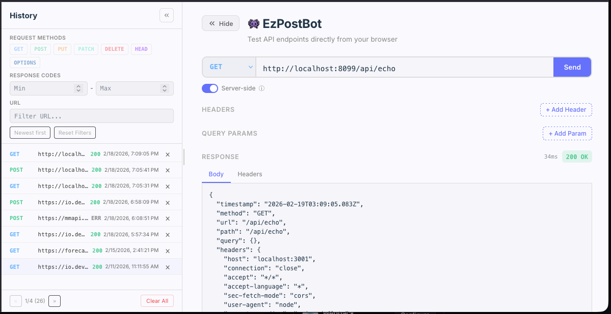

# 👾 EzPostBot



EzPostBot is a Postman-like tool that runs in your browser to test API connectivity, including CORS requests.

*Disclaimer*: I vibe coded this app in a few hours. I am not a UI engineer by trade.

## Technical Requirements

Install the following tools before running any command:

- `make`
- `node` and `npm`
- `docker` with `docker compose`

NOTE: if you just want to run the app & have Docker installed. There is no need to install any other requirements. `make docker-run` will just work & you can access the app at: `http://localhost:8099`

Recommended:

- Run from a Unix-like shell (`zsh`, `bash`, etc.)
- Ensure ports `3001` (API) and `8099` (debug UI) are available when using debug mode

## Quick Start (Makefile-first)

From the project root:

```bash
make build
make run
```

Then open the app URL printed by Vite in your terminal.

## Makefile Commands

### Local Development

- `make build`  
  Installs dependencies, builds the frontend, and creates local `data/` directory for SQLite.

- `make run`  
  Runs local development processes (`npm run dev`).

- `make debug`  
  Runs debug development mode on port `8099` (`npm run dev:debug`).

- `make clean`  
  Removes local build/runtime artifacts: `node_modules`, `dist`, and `data`.

### Docker

- `make docker-build`  
  Builds Docker images with `docker compose build`.

- `make docker-run`  
  Builds first, then runs containers in foreground with `docker compose up`.  
  Intended app URL: `http://localhost:8099`

- `make docker-stop`  
  Stops/removes running compose services.

- `make docker-clean`  
  Removes compose services, images, volumes, and local `data` directory.

## Built-in Echo API

EzPostBot ships with a built-in `/api/echo` endpoint that mirrors back everything you send — method, headers, query params, and body. It is the default URL when the app starts, making it easy to verify the tool itself without an external API.

The echo response includes:

| Field         | Description                          |
|---------------|--------------------------------------|
| `method`      | HTTP verb used (GET, POST, etc.)     |
| `url`         | Full request URL with query string   |
| `query`       | Parsed query parameters              |
| `headers`     | All request headers                  |
| `body`        | Parsed request body                  |
| `contentType` | Content-Type header value            |
| `timestamp`   | Server-side ISO timestamp            |
| `ip`          | Client IP address                    |
| `protocol`    | Request protocol (http/https)        |
| `hostname`    | Request hostname                     |

Supports all HTTP methods: `GET`, `POST`, `PUT`, `PATCH`, `DELETE`, `HEAD`, `OPTIONS`.

## Data Storage

- Request/response history is stored in SQLite under `data/history.db`.
- The `data/` directory is created during `make build`.
- `make clean` and `make docker-clean` remove the local database.

## Notes

- Some environments may print `EBADENGINE` warnings during `npm install`; these are filtered by `make build`.
- If a dev port is already in use, stop conflicting processes before running `make run` or `make debug`.
